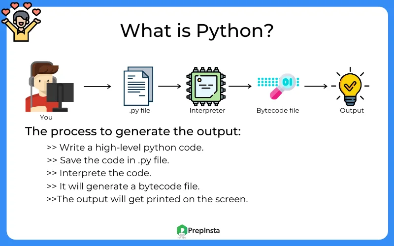
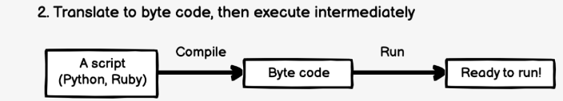
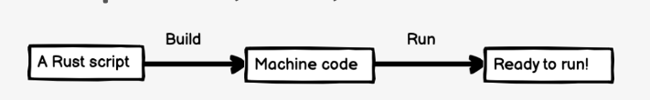

## Table of Contents

1. [What is Python?](#what-is-python)
2. [Difference Between Python and Other Languages](#difference-between-python-and-other-languages)
3. [Applications of Python](#applications-of-python)
4. [Installing Python/Anaconda](#installing-python-anaconda)
5. [Setting Up Jupyter Notebook](#setting-up-jupyter-notebook)

---

## What is Python?

Python is a high-level, interpreted programming language known for its simplicity and readability. Created by **Guido van Rossum** in 1991, Python has become one of the most popular programming languages due to its versatility and community support.

Key features of Python:
- **Easy to learn**: Its syntax is straightforward and resembles plain English.
- **Interpreted**: Python code is executed line by line, making debugging easier.
- **Open-source**: Freely available and maintained by a large community.
- **Portable**: Write code once, run it anywhere.
- **Extensive libraries**: Python offers a wide range of libraries for tasks like data analysis, web development, and machine learning.

---

## Difference Between Python and Other Languages

### How python file to generate the output







| Feature                  | Python                    | Java                      | C++                       |
|--------------------------|---------------------------|---------------------------|---------------------------|
| **Syntax**               | Simple and easy to read   | Verbose and strict        | Complex and verbose       |
| **Execution**            | Interpreted               | Compiled                  | Compiled                  |
| **Speed**                | Slower than compiled      | Faster than Python        | Fast                      |
| **Use Case**             | Versatile (AI, Web, etc.) | Enterprise applications   | System programming        |
| **Community Support**    | Large and active          | Large and enterprise-level| Strong, but less versatile|


---

## Applications of Python

Python is used in a wide variety of fields. Some of the most common applications include:

- **Web Development**: Frameworks like Django and Flask make Python popular for building web applications.
- **Data Analysis & Visualization**: Libraries such as Pandas, NumPy, and Matplotlib are essential for data manipulation and visualization.
- **Machine Learning & AI**: TensorFlow, PyTorch, and scikit-learn enable advanced AI and ML applications.
- **Scripting & Automation**: Python is often used for writing scripts to automate repetitive tasks.
- **Game Development**: Libraries like Pygame allow for game creation.
- **Scientific Computing**: Widely used in research and academia for simulations and modeling.

---

## Installing Python/Anaconda

### Option 1: Installing Python
1. Go to the [official Python website](https://www.python.org/).
2. Download the latest version suitable for your operating system (Windows, macOS, or Linux).
3. Run the installer and ensure you check the box **"Add Python to PATH"** (for Windows users).
4. Verify installation by opening a terminal/command prompt and typing:
   ```bash
   python --version
   ```

#### For macOS Users:
1. macOS comes with Python pre-installed. To check the version, open Terminal and type:
   ```bash
   python3 --version
   ```
2. If you need the latest version, you can use Homebrew to install it:
   ```bash
   brew install python3
   ```
3. After installation, verify by typing:
   ```bash
   python3 --version
   ```

### Option 2: Installing Anaconda
Anaconda is a popular distribution of Python that comes with pre-installed libraries and tools, including Jupyter Notebook.

1. Download Anaconda from [the official website](https://www.anaconda.com/).
2. Follow the installation instructions for your operating system.
3. Verify installation by opening the Anaconda Navigator.

#### For macOS Users:
1. Download the macOS installer from the [Anaconda website](https://www.anaconda.com/).
2. Open the `.pkg` file and follow the on-screen instructions.
3. Once installed, verify by typing:
   ```bash
   conda --version
   ```

---

## Setting Up Jupyter Notebook

Jupyter Notebook is an interactive environment to write and run Python code.

1. If you installed Anaconda, Jupyter Notebook is already included. Open it via the Anaconda Navigator or by typing `jupyter notebook` in the terminal.
2. If you installed Python separately, install Jupyter Notebook by running:
   ```bash
   pip install notebook
   ```
3. Start Jupyter Notebook by typing:
   ```bash
   jupyter notebook
   ```
4. A browser window will open. Create a new notebook and start coding!

---

Congratulations! You are now ready to start your journey into Python programming. 🎉

### Reference

https://www.geeksforgeeks.org/comparison-of-python-with-other-programming-languages/ 